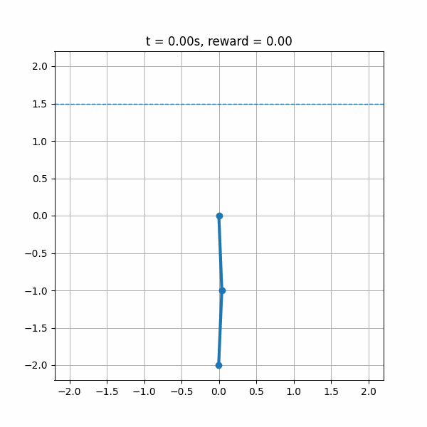
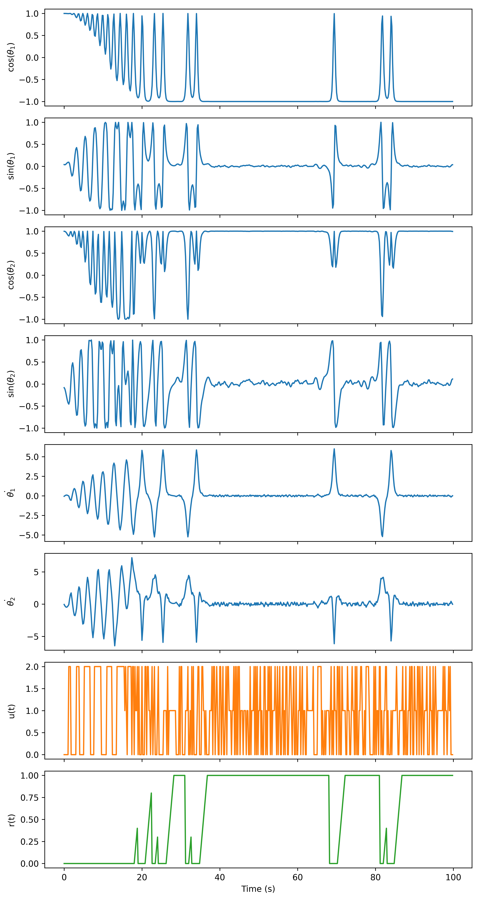

# CAS_Acrobot_DQL

CAS project implementing a **Deep Q-Learning (DQL)** algorithm on the **Acrobot** environment.

---

## Requirements

All required Python packages are listed in:

```
requirements.txt
```

Install them with:

```bash
pip install -r requirements.txt
```

---

## Running an Experiment

- Open the file `main.py`

- Set the experiment configuration by adjusting the variable `EXPERIMENT_N`

- The available configurations correspond to the following **target network update intervals**:

| EXPERIMENT_N | Target Update Interval |
|---------------|------------------------|
| 0 | 50 |
| 1 | 200 |
| 2 | 1000 |
| 3 | 5000 |

- Run the experiment from the project root:

```bash
python -m CAS_Acrobot_DQL.main
```

---

## Output

The script generates **three plots** that visualize training performance.  
If a filename is provided, the plots will also be **saved to disk**.

---

## Example Output

### Training Progress


### Learned Behaviour



### Episode Output



